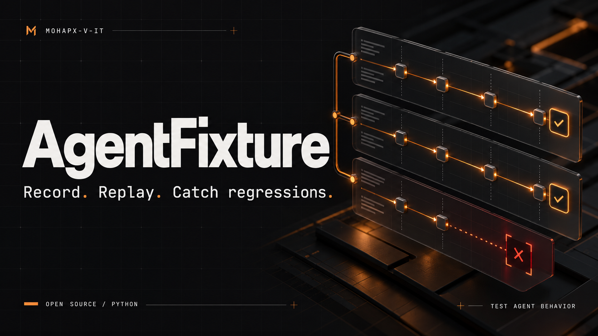

# AgentFixture

**Лови ошибки агента до запуска в продакшн.**

Записывай вызовы инструментов, воспроизводи ответы без API и проверяй аргументы, порядок, повторы и запрещённые действия.

[English](README.md) · [Документация](docs/usage.md) · [MIT](LICENSE)

## Попробовать

Python 3.11+. Выполни из папки репозитория; для ядра не нужны внешние зависимости.

```shell
python -m agentfixture init demo.json
python -m agentfixture check demo.json --html reports/demo.html
```

## Что внутри

Запись sync/async вызовов, маскирование по именам полей, строгий Replay, pytest-фикстуры, запуск набора сценариев, HTML/JSON/JUnit.

## Границы

Запись действительно выполняет callback. Replay последовательный; живую модель он не делает детерминированной. Маскирование по ключам не обнаруживает все персональные данные. Ранний релиз: API может меняться.

Автор: [Алексей Марышев / MOHAPX-V-IT](https://mohapx-v-it.github.io/mohapx-v-iti/).
